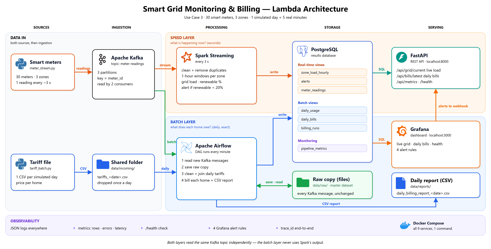

# Smart Grid Energy Monitoring & Billing

Applied Big Data Engineering mini-project: **Use Case 3, Smart Grid Energy Monitoring & Billing**.



A more detailed version, with every task and table, is in [docs/architecture.png](docs/architecture.png).

---

## 1. The problem

A power company has **30 homes** in **3 areas** (`north`, `central`, `south`).
Every home has a smart meter, and some homes also have solar panels.

The company wants answers to two questions:

1. **Right now:** how much electricity is each area using, and how much of it
   comes from solar?
2. **Every day:** what is each home's bill, once that day's electricity price
   (tariff) is applied?

This is the business question from the assignment:
*"What is the current grid load and renewable contribution by zone, and what
will each household's bill look like once daily tariff data is applied to their
consumption?"*

**What the assignment asks for, and where to find it:**

| Assignment asks for | Where it is |
|---|---|
| An API showing live grid load and renewable % by area | `GET /api/grid/current` |
| An alert when renewable % is very low | `LOW_RENEWABLE` alerts (Spark), plus a Grafana alert rule |
| A daily billing and solar report per home | Airflow writes it to the database and to `data/reports/*.csv`; also shown in Grafana |

---

## 2. The big picture

```text
                     ┌──► Spark Streaming ──► live views + alerts   (speed layer) ──┐
 meter_stream.py ──► Kafka                                                          ├──► PostgreSQL ──► FastAPI + Grafana
 (a reading / ~3 s)  └──► Airflow ──► raw copy (data/raw/) ──► daily bills  (batch layer)
                              ▲
 tariff_batch.py ──► data/incoming/tariffs_<date>.csv
 (one file / day)
```

Kafka feeds **two independent layers**, which is the textbook Lambda
architecture:

- **Speed layer:** Spark reads Kafka and produces live numbers within seconds.
- **Batch layer:** Airflow subscribes to the same Kafka topic separately (its
  own consumer group), keeps an exact copy of every message, and once a day
  cleans that raw data itself, joins it with the tariff file and calculates the
  bills.

The batch layer uses **nothing** the speed layer produces. It keeps working
even if Spark is down.

| Part | Tool | Code |
|---|---|---|
| Live data source | Python script | `simulators/meter_stream.py` |
| Daily data source | Python script | `simulators/tariff_batch.py` |
| Message queue | Apache Kafka | `docker-compose.yml` |
| Live processing (speed layer) | Spark Structured Streaming | `spark/stream_job.py` |
| Daily processing (batch layer), incl. reading Kafka | Apache Airflow | `airflow/dags/daily_billing_dag.py`, `common/kafka_ingest.py` |
| Database | PostgreSQL | `sql/init.sql` |
| API | FastAPI | `api/main.py` |
| Dashboard and alert rules | Grafana | `grafana/` |
| Shared code (clock, homes, validation, billing, Kafka ingestion, raw copy, logging) | Python | `common/` |
| Tests | pytest | `tests/` |

The diagrams are `docs/architecture_simple.png` (overview, at the top) and `docs/architecture.png` (detailed); editable `.svg` versions sit next to them.

---

## 3. Simulated time

Nobody can wait a real day to see a bill, so time runs faster:

```text
1 simulated day      = 5 real minutes   (288 times faster)
1 meter reading      = every 15 simulated minutes = about every 3 real seconds
first simulated day  = 2026-01-01
random seed          = 42  → every run produces exactly the same data
```

All processing uses the **time written inside each reading** (called *event
time*), not the computer's clock. So "1 hour" always means one simulated hour.

The values are set in `docker-compose.yml` (`SIM_DAY_SECONDS`, `SIM_START_DATE`, `SIM_SEED`).

---

## 4. How it works, step by step

### Step 1: The two data sources (Python)

**`meter_stream.py`: the live source.** Every 15 simulated minutes, each of
the 30 meters sends one message with exactly the assignment's fields:

```json
{"meter_id": "M001", "household_id": "H001", "grid_zone": "north",
 "power_consumption_kwh": 0.21, "solar_generation_kwh": 0.64,
 "timestamp": "2026-01-01T10:15:00Z"}
```

To make it realistic and to test the pipeline, the simulator also:

- follows a daily pattern: homes use more electricity in the morning and
  evening, and solar only produces between 06:00 and 18:00;
- creates a **storm over one area from 10:00 to 14:00 every day** (`north` on
  day 1, `central` on day 2, `south` on day 3, …). Solar drops almost to zero,
  so the low-renewable alert fires;
- sends about **2% bad records** (negative values, missing fields, an unknown
  area, broken JSON) and about **1% duplicates**, so the cleaning steps have
  something to catch;
- after a restart, first **re-sends the readings it missed** (up to one day),
  like a real meter uploading its memory. Duplicates are removed later.

**`tariff_batch.py`: the daily source.** At the start of every simulated day it
drops one file, `data/incoming/tariffs_<date>.csv`:

```csv
household_id,tariff_rate,billing_tier,subsidy_flag
H001,0.1623,A,true
```

- The price per kWh depends on the home's tier (A 0.16, B 0.19, C 0.23) and
  changes a little every day.
- **Every third day, one row is deliberately broken** (a blank or negative
  price), to show that bad batch data is caught.

### Step 2: Kafka (the message queue)

Meter readings go to the Kafka **topic** `meter-readings`:

- It has **3 partitions**.
- Each message is **keyed by `meter_id`**, so all readings from one meter go to
  the same partition and stay in order.
- Each message carries two **headers** for tracing: `trace_id` and `produced_at`.
- **Two independent consumers** read the topic, each with its own consumer group
  and its own position in the topic:
  1. Spark (the speed layer);
  2. Airflow (the batch layer), consumer group `airflow-batch`.

### Step 3: Spark (the speed layer: "what is happening right now?")

Spark reads Kafka in **small batches every 3 seconds** and does two jobs.

**Job 1: clean the data and store it.**

1. Parse each message and check it: all fields present, a known area, no
   negative numbers.
2. Bad records go to `rejected_readings` **with the reason**, for example
   `unknown_grid_zone`.
3. Duplicates are removed, in two places:
   - inside each batch, with `dropDuplicates`;
   - across batches, because the table's primary key is `(meter_id, event_time)`.
4. Clean readings are saved in `meter_readings`. These are used for the live
   views, the health check and tracing.

**Job 2: live totals per area.**

1. Group readings into **1-hour windows per area**.
2. For each window, calculate:
   - total consumption;
   - total solar;
   - net grid load (consumption minus solar);
   - **renewable %**, the share of consumption covered by solar.
3. Readings up to 1 simulated hour late are still counted. This allowance is
   called the **watermark**.
4. Results are saved in `zone_load_hourly`.

**Alert rule:** between 09:00 and 15:00, if an area's renewable % drops below
**20%**, Spark saves a `LOW_RENEWABLE` alert. It only judges an hour once at
least 75% of that hour's readings have arrived.

### Step 4: Airflow (the batch layer: "what does each home owe?")

The Airflow job (a *DAG*) runs **every minute**. It has 6 tasks. Two of them
run **in parallel**:

```text
ingest_from_kafka ── pick_day ──┬── load_tariffs ──────────┬── compute_bills ── export_report
                                └── process_raw_readings ──┘
```

**1. ingest_from_kafka: read the topic as a batch (every run).**

Airflow subscribes to the Kafka topic itself (consumer group `airflow-batch`),
completely separately from Spark. Each run:

1. notes where the topic ends **right now**;
2. reads everything from where the last run stopped, up to that point (about
   600 messages, taking ~1 second);
3. saves every message **exactly as received**, including the bad ones, to the
   raw copy:

   ```text
   data/raw/date=2026-01-01/part-0.jsonl   ← one folder per simulated day,
   data/raw/date=2026-01-01/part-1.jsonl     one file per Kafka partition
   data/raw/date=2026-01-01/part-2.jsonl
   data/raw/date=unparsed/part-0.jsonl     ← messages with no readable timestamp
   data/raw/_latest_event_time             ← newest event time saved so far
   ```

   Each line holds one message plus where it came from:

   ```json
   {"partition": 0, "offset": 0, "key": "M001", "trace_id": "e616…", "produced_at": "1790237789497",
    "archived_at": "2026-09-24T08:16:39.110+00:00", "value": "{\"meter_id\": \"M001\", … }"}
   ```

4. only then tells Kafka "done up to here" (commits the offsets). A failed run
   never loses data: Kafka keeps the messages, and the next run reads them
   again. At worst a message is saved twice, and step 3 below removes
   duplicates.

This raw copy is the batch layer's **master dataset**: it never changes, so any
day can be recalculated from the original data at any time. (Files are JSON
lines for simplicity; in production they would be Parquet on S3 or HDFS.)

**2. pick_day:** finds the first day that has a tariff file and saved raw
readings, is finished (the raw copy holds readings from 1 simulated hour into
the next day), and hasn't been billed yet. If there isn't one, the billing
tasks are skipped for this run.

**3. process_raw_readings:** reads that day's raw copy and cleans it
**itself**, with the same rules as Spark (`common/validation.py`):

- rejects bad records;
- removes duplicates;
- totals each home's day (consumption, solar, electricity bought from and sent
  to the grid) into `daily_usage`.

**4. load_tariffs** (at the same time as step 3): checks every row of the
tariff CSV. Bad rows are rejected and logged. Good rows are saved to `tariffs`.

**5. compute_bills:** SQL **joins `daily_usage` with that day's tariffs**. Then
`common/billing.py` calculates each bill:

```text
energy charge  = electricity bought from the grid × price
solar credit   = solar electricity sent back to the grid × price × 50%
service charge = fixed daily charge by tier (A 0.50 / B 0.75 / C 1.00)
subsidy        = 20% off the energy charge, if the home is eligible
total bill     = energy charge − solar credit + service charge − subsidy
```

A home with readings but no valid tariff row is counted as **unbilled**.

**6. export_report:** writes `data/reports/daily_billing_report_<date>.csv` and
marks the day as done.

Every step is **safe to run again**. Re-running a day recalculates it from the
raw copy and gives exactly the same bills.

### Step 5: PostgreSQL (the database)

| Table | Filled by | What it holds |
|---|---|---|
| `meter_readings` | Spark | clean readings seen by the speed layer (live views, health, tracing) |
| `rejected_readings` | Spark | bad readings and why they were rejected |
| `zone_load_hourly` | Spark | live hourly totals per area |
| `alerts` | Spark | low-renewable alerts |
| `tariffs` | Airflow | checked daily prices |
| `daily_usage` | Airflow | each home's cleaned daily totals, from the raw copy |
| `daily_bills` | Airflow | one bill per home per day |
| `billing_runs` | Airflow | one summary row per billed day (incl. raw records, rejected, duplicates) |
| `pipeline_metrics` | Spark and Airflow | row counts, timings and delays (for monitoring) |

The batch layer's master dataset (the raw copy of the Kafka messages) is kept
as files in `data/raw/`, not in the database.

### Step 6: The API and the dashboard

**API** (FastAPI). Interactive docs: http://localhost:8000/docs

| Endpoint | What it returns |
|---|---|
| `GET /api/grid/current` | live load, solar and renewable % for each area |
| `GET /api/grid/history?hours=24` | hourly totals for the last N hours |
| `GET /api/alerts` | the latest low-renewable alerts |
| `GET /api/bills/latest` | the latest daily billing report |
| `GET /api/bills/2026-01-01` | the billing report for one day |
| `GET /api/metrics` | pipeline numbers: readings in, rejected, duplicates, delay, archive freshness |
| `GET /api/trace/{trace_id}` | the full journey of one reading |
| `GET /health` | `ok`, or `stale` if no data has arrived for 60 seconds |
| `POST /api/alert-webhook` | receives Grafana alert notifications and logs them |

**Dashboard** (Grafana). Open http://localhost:3000; it goes straight to the
*Smart Grid Monitoring & Billing* dashboard, which has 3 sections:

1. **Live grid:** load and renewable % per area, alerts, and 24-hour bar charts.
2. **Daily billing report:** the bill for every home, with totals and how many
   raw readings the batch layer rejected.
3. **Pipeline health:** how fresh the live data and the batch ingestion are,
   invalid %, duplicates, delay, and the latest rejected readings with their
   trace IDs.

---

## 5. Why a Lambda architecture (and not Kappa)

The two questions need different things:

| | "What's happening now?" | "What does each home owe?" |
|---|---|---|
| Needs | an answer within seconds | an exact, repeatable number |
| Can be slightly off? | yes | no, it's money |
| Handled by | **speed layer**: Spark | **batch layer**: Airflow |

A Lambda architecture has one layer for each need. **Both layers subscribe to
the same Kafka topic independently**: Spark processes each message as it
arrives, and Airflow reads the topic in batches. The batch layer keeps its own
**raw, unchangeable copy** of all data (the master dataset), so it can always
recalculate from the original data.

**Why we rejected Kappa** (where everything is processed as a single stream):

1. **Bills must be exact and repeatable.** In a stream, results keep changing as
   late or duplicate readings arrive. A bill should be calculated once, after
   the day is complete, from all of its data.
2. **Recalculating is expensive.** Kappa recalculates by replaying Kafka, so
   Kafka would have to keep all history forever. We keep the history in the raw
   copy, and Kafka is only a short buffer.
3. **The tariff comes as a daily file, not a stream.** A scheduled daily job
   fits it naturally.

**The price we pay:**

- **Two code paths.** The cleaning rules exist twice: in Spark, and in
  `common/validation.py` for the batch layer. A test
  (`test_speed_and_batch_layers_reject_the_same_records`) checks that they
  always give the same result.
- **Live and final numbers can differ slightly.** For example, a duplicate
  reading is counted in the live hourly total but not in the bill.

That is the normal Lambda trade-off: fast first, exact later.

---

## 6. Why these tools

| Tool | Why it fits this project |
|---|---|
| **Kafka** | Meters send a never-ending stream of readings. Kafka stores them safely and lets **two consumers read independently** (speed and batch layers). Partitions keyed by `meter_id` keep each meter's readings in order. |
| **Spark Structured Streaming** | Has built-in time windows and late-data handling (watermarks), which we need because every reading has its own timestamp. Batches every 3 seconds are fast enough for live monitoring. Checkpoints let it restart where it stopped. |
| **Raw copy (files)** | An append-only, unchangeable copy of every message, which is exactly what Lambda's master dataset should be. Files are cheap and simple; in production this would be Parquet on S3 or HDFS. |
| **Airflow** | The batch layer is a scheduled job with ordered (and parallel) steps: read the new Kafka messages, then bill each finished day. Airflow gives the schedule, retries and a history of every run in its web UI. |
| **PostgreSQL** | The results are small and structured, and the queries need SQL joins (usage + tariffs). Primary keys make re-runs safe (no duplicates). `NUMERIC` stores money exactly. |
| **FastAPI** | Small and simple, with automatic API documentation at `/docs`. |
| **Grafana** | Builds the dashboard straight from PostgreSQL, so there's no dashboard code to write. It also runs the alert rules and sends notifications. Everything is set up from files, so it's the same on every machine. |
| **Docker Compose** | One command starts all 9 services with the same versions on any computer. |

---

## 7. Monitoring (observability): how we know it's working

| What | How | Why |
|---|---|---|
| **Logs** | Every part writes one JSON line per event, e.g. `{"service": "airflow-billing", "event": "kafka_messages_ingested", "messages": 576}` | Easy to search and filter, and shows which part and which batch a problem came from. |
| **Metrics** | `pipeline_metrics` stores, for every batch of every stage (Spark, Airflow ingestion, Airflow billing): rows in, valid, invalid, duplicate, processing time and **end-to-end delay** (about 3 seconds). Shown in Grafana and at `/api/metrics`. | Shows speed, data quality and delay over time. |
| **Health check** | `/health` returns `ok`, or `stale` if no reading arrived in 60 seconds. | Shows at a glance whether data is still flowing. |
| **Alert rules** (Grafana) | 1. No meter data for 60 s. 2. Airflow hasn't read Kafka for 3 minutes. 3. More than 5% invalid readings. 4. Low renewable % in an area. | Rules 1–3 catch pipeline failures in both layers. Rule 4 is the business alert from the assignment. |
| **Alert delivery** | Grafana sends every alert to `POST /api/alert-webhook`, which logs it as a `grafana_alert` line. | Alerts end up in the logs, not just on a screen. In production: email or Slack. |
| **Tracing** | Every reading has a `trace_id` in its Kafka header. It appears in the simulator log, the Spark log, the raw copy and the database. `/api/trace/<id>` shows its journey. | To follow one reading: was it sent, was it rejected and why, which hourly total and which bill did it go into? |

---

## 8. How to run it

> For the full step-by-step guide (setup, checks, every UI, demo script and
> troubleshooting), see **[run_book.md](run_book.md)**.

**You need:** Docker Desktop and about 4 GB of free memory.

```bash
docker compose up -d --build    # the first time downloads about 3 GB of images
docker compose ps               # everything "Up"; kafka-init "Exited (0)" is normal
```

| Open | Address | Login |
|---|---|---|
| Dashboard (Grafana) | http://localhost:3000 | none needed to view; `admin` / `admin` to edit |
| API docs | http://localhost:8000/docs | – |
| Airflow | http://localhost:8080 | `admin` / `admin` |
| Database | `localhost:5432`, database `smartgrid` | `grid` / `grid` |

### What you will see (timeline)

| Real time after start | What happens |
|---|---|
| about 1 minute | Live data appears on the dashboard; `/health` shows `ok`; Airflow starts filling `data/raw/` every minute |
| about 2–3 minutes | Storm over `north`: 4 low-renewable alerts appear |
| about 6 minutes | Airflow bills **2026-01-01** from its raw copy: first daily report and CSV file |
| every 5 minutes after | Another day is billed, and the storm moves to the next area |
| about 16 minutes | Day 2026-01-03: one broken tariff row is rejected, so 29 homes are billed and 1 is *unbilled* |

### Stop, or start again from day 1

```bash
docker compose down         # stop (keeps the data)

docker compose down -v      # stop and delete the database, Kafka data and Spark checkpoints
rm -rf data                 # then delete the raw copy, tariff files, reports and the clock
docker compose up -d        # start fresh from 2026-01-01
```

Always do **both** `down -v` and `rm -rf data`, in that order. On Windows
PowerShell, use `Remove-Item -Recurse -Force data`.

### Run the tests

```bash
pip install -r requirements-dev.txt   # the Spark tests also need Java 17 or newer
python -m pytest                      # 38 tests, no Docker needed
```

| Test file | What it checks |
|---|---|
| `tests/test_simulators.py` | readings have exactly the assignment's fields; the same seed gives the same data; no solar at night; the storm pushes renewable % below 20%; bad records really are bad; tariff files are correct |
| `tests/test_stream_validation.py` | the real Spark code: each kind of bad record gets the right reason; trace IDs are read; hourly totals are correct; **Spark and the batch layer reject exactly the same records** |
| `tests/test_batch_readings.py` | Airflow's Kafka ingestion keeps messages unchanged; the batch layer's cleaning, de-duplication and daily totals; raw-copy folders |
| `tests/test_billing.py` | tariff row checks (blank, negative, wrong tier, …); the bill formula with and without solar and subsidy |

---

## 9. Limitations, and what we would change in a real system

- **Simulated data.** There are no real meters or billing system. The prices,
  charges, subsidy and solar credit are simple made-up rules.
- **Small scale.** 30 meters, 1 Kafka broker, Spark on one machine, one
  database. A real system would use a Kafka cluster, Spark on a cluster, and
  keep the raw copy as Parquet files on S3 or HDFS (here it's JSON lines on a
  local disk). The batch layer would then run on Spark too, instead of plain
  Python, and a dedicated tool (e.g. Kafka Connect) would copy Kafka to storage
  instead of an Airflow task.
- **Airflow reads Kafka.** If Airflow is stopped, messages wait in Kafka
  (kept for 7 days by default) and are read when it restarts. After 7 days
  they would be lost.
- **Messages with no readable timestamp** are archived in `date=unparsed/` but
  can't belong to any day, so they are never part of a bill.
- **Live numbers are approximate.** The live hourly totals count duplicate
  readings (about 1%) and skip readings more than 1 hour late. The daily
  bills are exact.
- **Airflow timing.** Airflow checks every real minute because of the fast
  clock. In a real system it would run once a day (e.g. at 01:00) and wait for
  the tariff file.
- **Security.** Demo passwords are written in `docker-compose.yml`, and the API
  has no login. A real system would use a secret manager and authentication.
- **Monitoring.** Metrics are kept in PostgreSQL and alerts go to a webhook.
  A real system would use Prometheus for metrics, a log system such as Loki or
  ELK, OpenTelemetry for tracing, and would send alerts by email or Slack.

---

## 10. Team contributions

*(fill in: who did what)*

- Member 1 –
- Member 2 –
- Member 3 –
